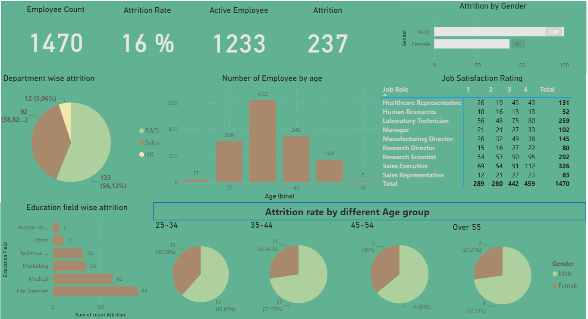

# Power-BI-Project-HR-Attrition-Dashboard

This project is an interactive HR analytics dashboard built with Power BI, designed to provide insights into employee attrition trends and workforce demographics. The dashboard helps HR managers and decision-makers identify key factors influencing employee turnover and workforce distribution.

# Features:

Workforce Overview: Track total employees, active employees, attrition count, and attrition rate.

Department-wise Attrition: Visualize attrition across departments such as Sales, R&D, and HR.

Education-wise Attrition: Analyze attrition trends across different education fields (Life Sciences, Medical, Marketing, etc.).

Gender-wise Attrition: Compare attrition between male and female employees.

Age-wise Distribution: View the number of employees across different age bins and analyze attrition by age group.

Job Satisfaction Analysis: Breakdown of job satisfaction ratings (1–4) by role.

# Key Visualizations:

KPI Cards: High-level metrics for employee count, attrition rate, and active employees.

Pie Charts: Attrition by department, education field, and age group.

Bar Charts: Employee count by age and attrition by gender.

Matrix Table: Job satisfaction ratings by job role.

This dashboard enables HR teams to monitor attrition patterns, identify high-risk groups, and support data-driven retention strategies.

# Screenshot:

